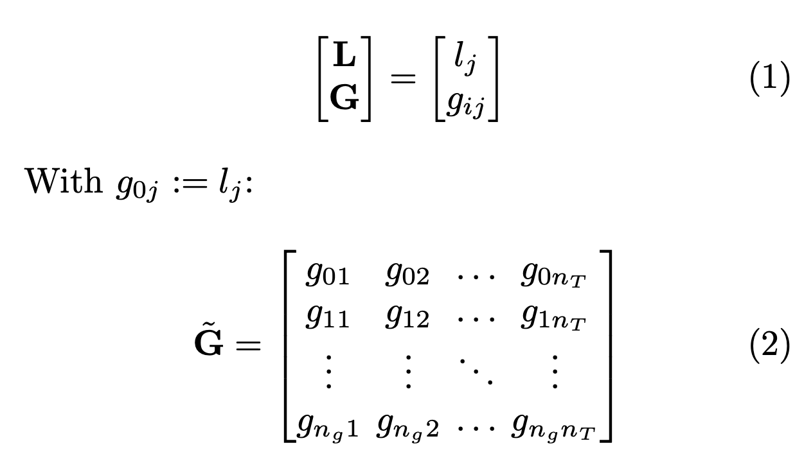

# Electric Generation Forecasting (EGF)

## AI-based Prediction of the German Electricity Mix

This repository deals with AI-based prediction of the German electricity mix.

All Python source code can be found in `egf/`. Modules can be tested by executing them directly with `python <module>.py`:
- `entsoe_dataset.py`: Module for ENTSO-E dataset base class
- `pslp.py`: PSLP module
- `sarima.py`: SARIMA module
- `lstm.py`: Single-step LSTM model module
- `utils.py`: Utility functions
- `lstm_single_step.ipynb`: Jupyter notebook illustrating how to train a single-step LSTM on scaled ENTSO-E generation 
  and load data.

`lstm_ckpts` contains exemplary checkpoints of a single trained single-step LSTM network.

### Problem
We want to perform time series prediction of the ENTSO-E actual generation per production type and actual load data, 
i.e., predict the values of these quantities as a "vector" for the next time step(s) from historic data. For this 
multivariate time series forecasting, we make each generation type a feature in the input data where the number of 
output features should match number of input features. This basically is multi output regression.  
We are interested in the short-term load forecasting regime (from 24 h to one week). STLF is essential for controlling 
and scheduling of the power system in making everyday power system operation, interchange evaluation, security 
assessment, reliability analysis, and spot price calculation, which leads to the higher accuracy requirement compared to 
long-term prediction. Also see https://www.entsoe.eu/Technopedia/techsheets/enhanced-load-forecasting.

### Data
We consider the actual generation per production type and the actual load in Germany from the [ENTSO-E 
transparency platform](https://transparency.entsoe.eu/). The data is published daily and has a 15-min frequency. 
**After applying for your personal security token**, you can download the data via the RESTful API from the ENTSO-E 
transparency platform. We use the [entsoe-py Python package](https://github.com/EnergieID/entsoe-py) as a Python client for this.

From the [official documentation](https://eur-lex.europa.eu/LexUriServ/LexUriServ.do?uri=OJ:L:2013:163:0001:0012:EN:PDF):

> #### Actual Generation per Production Type
>Actual aggregated net generation output (MW) per market time unit and per production type.
> The information shall be published no later than one hour after the operational period.

>**Specification of calculation** Average of all available instantaneous net generation output values on each market time unit. If a net generation output is not known, it shall be estimated. The actual generation of small-scale units might be estimated if no real-time measurement devices exist.

>**Primary owner of the data** Owners of generation units or transmission system operators (TSOs)  
>**Data provider** TSOs or other Data Provider of information depending on local organisation.

#### Manual inspection of exemplary data for GER downloaded as CSV file 

In an exemplary data snippet downloaded for Germany, there are 23 columns, i.e., raw features:
>- A. Area: All the same because we are only interested in Germany (DE).
>- B. MTU: Considered time window (start + end with delta = 15 min)
>- C. Biomass - Actual Aggregated [MW]
>- D. Fossil Brown coal/Lignite - Actual Aggregated [MW]
>- E. Fossil Coal-derived gas - Actual Aggregated [MW]
>- F. Fossil Gas - Actual Aggregated [MW]
>- G. Fossil Hard coal - Actual Aggregated [MW]
>- H. Fossil Oil - Actual Aggregated [MW]
>- I. Fossil Oil shale - Actual Aggregated [MW]
>- J. Fossil Peat - Actual Aggregated [MW]
>- K. Geothermal - Actual Aggregated [MW]
>- L. Hydro Pumped Storage - Actual Aggregated [MW]
>- *M. Hydro Pumped Storage  - Actual Consumption [MW]* WHAT IS THIS?
>- N. Hydro Run-of-river and poundage - Actual Aggregated [MW]
>- O. Hydro Water Reservoir - Actual Aggregated [MW]
>- P. Marine - Actual Aggregated [MW]
>- Q. Nuclear - Actual Aggregated [MW]
>- R. Other - Actual Aggregated [MW]
>- S. Other renewable - Actual Aggregated [MW]
>- T. Solar - Actual Aggregated [MW]
>- U. Waste - Actual Aggregated [MW]
>- V. Wind Offshore - Actual Aggregated [MW]
>- W. Wind Onshore - Actual Aggregated [MW]

To reduce the problem complexity, we apply the category mapping from Unnewehr et al. (2022), 
*Open-data based carbon emission intensity signals for electricity generation in European countries – 
top down vs. bottom up approach*, Cleaner Energy Systems, Volume 3, 2022, doi: [10.1016/j.cles.2022.100018](https://doi.org/10.1016/j.cles.2022.100018):
>- Actual Load: Actual Load
>- Hard Coal: Fossil Hard coal Actual Aggregated
>- Lignite: Fossil Brown coal/Lignite Actual Aggregated
>- Gas: Fossil Gas Actual Aggregated
>- Other Fossil: Fossil Coal-derived gas Actual Aggregated, Fossil Oil Actual Aggregated, Other Actual Aggregated
>- Nuclear: Nuclear Actual Aggregated
>- Biomass: Biomass Actual Aggregated
>- Waste: Waste Actual Aggregated
>- Other Renewable: Geothermal Actual Aggregated, Other renewable Actual Aggregated
>- Hydro: Hydro Pumped Storage Actual Aggregated, Hydro Run-of-river and poundage Actual Aggregated, Hydro Water Reservoir Actual Aggregated
>- Solar: Solar Actual Aggregated
>- Wind Onshore: Wind Onshore Actual Aggregated
>- Wind Offshore: Wind Offshore Actual Aggregated

Feel free to also check out:
- https://ag-energiebilanzen.de/wp-content/uploads/2023/03/STRERZ22A11_Abg_0223.pdf
- https://www.cleanenergywire.org/factsheets/germanys-energy-consumption-and-power-mix-charts

We consider the actual aggregated net generation output (MW) per market time unit and per production type, $\mathbf{G}$, in Germany (https://transparency.entsoe.eu/content/static_content/Static\%20content/knowledge\%20base/data-views/generation/Data-view\%20Actual\%20Generation\%20per\%20Production\%20Unit.html). 
The actual generation is computed as the average of all available instantaneous net generation output values on each market time unit. 
If a net generation output is not known, it shall be estimated. 
The actual generation of small-scale units might be estimated if no real-time measurement devices exist. 
In addition, we consider the total load per market time unit, $\mathbf{L}$, in Germany (https://transparency.entsoe.eu/content/static_content/Static\%20content/knowledge\%20base/data-views/load-domain/Data-view\%20Total\%20Load\%20-\%20Day\%20Ahead\%20-\%20Actual.html). 
The actual generation per production type can be expressed as a $n_g \times n_T$ matrix where each row corresponds to the temporal evolution of the generation of one production type. 
The actual load is a $1 \times n_T$ matrix (or row vector).
Line indices of concatenated data matrix specify data type, i.e., load or generation type, column indices specify 
considered point in time. 

### Models
*Note that only PSLPs and a single-step LSTM are implemented in the scope of this repo.*

[https://www.entsoe.eu/Technopedia/techsheets/enhanced-load-forecasting](https://www.entsoe.eu/Technopedia/techsheets/enhanced-load-forecasting)
#### Statistical methods

##### Persistence
Persistence is a trivial baseline model or reference used for evaluating a more sophisticated model's predictive power 
/ performance. It represents probably the simplest way of producing a forecast. A persistence model assumes that the 
future value of a time series is calculated under the assumption that nothing changes between the current time and the 
forecast time, i.e., tomorrow will be the same as today. In terms of the electricity mix, a persistence model would 
estimate that the mix at time $t+1$ equals the mix at time $t$.

##### Personalized standard load profiles (PSLPs)
Personalized standard load profiles divide the time series data into three different categories, i.e., weekdays, 
Saturdays, and Sun-/Holidays (also see [`holidays`](https://pypi.org/project/holidays/) Python package). The forecast $\text{Last}(n)$ is calculated as the average of the last $n$ profiles in the 
same category. Usually, $n$ is set to 3 to also capture seasonal and weather-related changes to a certain degree. Note 
that a $\text{Last}(1)$ corresponds to a category-based persistence model.  

> D. Peters, R. Völker, F. Schuldt and K. von Maydell, "Are standard load profiles suitable for modern electricity grid 
> models?," 2020 17th International Conference on the European Energy Market (EEM), Stockholm, Sweden, 2020, pp. 1-6, 
> doi: [10.1109/EEM49802.2020.9221967](https://doi.org/10.1109/EEM49802.2020.9221967).

##### Auto-Regressive Integrated Moving Average (ARIMA)
ARIMA is a popular time series forecasting method that models the next value in a sequence based on linear dependencies 
between previous observations, differences of past observations, and past forecast errors. It combines autoregression 
(AR), differencing (I), and moving average (MA) components.

1. **AR:** This component models the next value in the series as a linear combination of past values. 
   It assumes that the future values depend linearly on the previous observations.
2. **I:** This component involves differencing the time series data to make it stationary, i.e., to remove trends and 
   seasonality.
3. **MA:** This component models the next value in the series as a linear combination of past forecast errors. It helps 
   capture short-term fluctuations or noise in the data.

Seasonal ARIMA extends ARIMA to handle seasonal patterns in the data. It includes additional seasonal AR and MA terms to 
account for periodic fluctuations. A useful Python package in this context is [`pmdarima`](http://alkaline-ml.com/pmdarima/).
For a given time series, the "forecast frame" for an SARIMA model (for calculating residuals with respect to actual data, 
similar to PSLP) depends on the model's (seasonal) orders p, q, P, and Q!

Feel free to check out the link collection below to learn more about this topic.

* (Partial) Autocorrelation Function
  * https://www.youtube.com/watch?v=DeORzP0go5I
  * https://machinelearningmastery.com/gentle-introduction-autocorrelation-partial-autocorrelation/
* Stationarity
  * https://www.youtube.com/watch?v=oY-j2Wof51c&list=PLvcbYUQ5t0UHOLnBzl46_Q6QKtFgfMGc3&index=4
* AR
  * https://www.youtube.com/watch?v=5-2C4eO4cPQ 
  * https://www.youtube.com/watch?v=Mc6sBAUdDP4
* MA
  * https://www.youtube.com/watch?v=voryLhxiPzE
* ARIMA
  * https://www.youtube.com/watch?v=3UmyHed0iYE
* SARIMA
  * https://www.youtube.com/watch?v=4hrMdu9CSQs
  * https://www.youtube.com/watch?v=WjeGUs6mzXg
  * https://365datascience.com/tutorials/python-tutorials/arimax/
  * https://www.statsmodels.org/stable/generated/statsmodels.tsa.arima.model.ARIMA.html
  * https://machinelearningmastery.com/sarima-for-time-series-forecasting-in-python/
  * https://www.alldatascience.com/time-series/forecasting-time-series-with-auto-arima/
  * https://machinelearningmastery.com/how-to-grid-search-sarima-model-hyperparameters-for-time-series-forecasting-in-python/
  * https://www.statsmodels.org/dev/generated/statsmodels.tsa.statespace.sarimax.SARIMAX.html

    
#### Deep-learning methods
##### Recurrent Neural Networks (RNNs)
[RNNs](https://www.youtube.com/watch?v=AsNTP8Kwu80), including [Long Short-Term Memory (LSTM)](https://www.youtube.com/watch?v=YCzL96nL7j0) 
networks, are specialized architectures for processing sequential data. They maintain a memory of past inputs, allowing 
them to capture temporal dependencies and handle tasks like time series prediction, natural language processing, and 
speech recognition. LSTMs, in particular, address the vanishing gradient problem and excel at learning long-term 
dependencies. When using an LSTM, we typically predict the next time step based on a given input sequence. However, if 
we want to forecast multiple time steps into the future, we need to iteratively perform predictions on our previous 
predictions. This process is often referred to as "multi-step forecasting" or "iterative forecasting". 

- **Single-step forecast:** Predict only one time step ahead based on the current input sequence. 
- **Multi-step forecast:** Predict multiple time steps into the future. To do this, repeatedly apply the single-step 
  forecasting process. After predicting one time step ahead, append the predicted value to the input sequence and use it 
  to predict the next time step. Continue until you have predicted the desired number of time steps into the future.
  However, it's essential to consider the potential accumulation of errors over each prediction step, which can affect 
  the accuracy of long-term forecasts. 

For the single-step LSTM used here, we combine LSTM layer(s) with a fully connected part with one layer to transform 
LSTM output to right output dimension. Note that we could in principle also predict sequences with an LSTM by setting the 
output dimension, or rather number of predicted output features (to be reshaped to the actually desired output dimension),
of the fully connected part accordingly. Here's how it works:

- **LSTM layer:** The LSTM layer processes the input sequence and captures temporal dependencies within the data. It accepts 
  input sequences of arbitrary length and generates a fixed-size output (often just the final hidden state) that 
  summarizes the input sequence.
- **Linear layer:** The linear layer (also known as a fully connected layer) takes the output of the LSTM layer and performs 
  a linear transformation on it. This layer can learn to map the LSTM's output to the desired output dimension of the 
  sequence to be predicted.
- **Reshaping:** After passing through the linear layer, the output is reshaped according to the desired output dimension of 
  the sequence to be predicted. For example, if you're predicting sequences of multiple features, you would reshape the 
  output to match the desired shape of the output sequences.

This approach allows you to predict entire sequences at once, e.g., en bloc one-day ahead, rather than predicting them 
step by step. It can be particularly useful when you want to generate forecasts for multiple time steps ahead 
simultaneously. 

Out of experience, in time series forecasting, most of the time, simpler is better. Some more things to consider, in
particular when looking at our single-step LSTM model implementation in `egf/lstm.py`:
- Normalize load data first before calculating PSLPs.
- Simply train LSTM on normalized load data, not on residuals w.r.t. PSLPs.
- Use same scaler to normalize all the data to preserve information about relative quantities across the different
  features in the input data. The actual load should be the measure of all things as the complete generation should sum 
  up to just cover the actual load.
- Start with only one LSTM layer with hidden size of 16. Networks typically perform best with one layer only (noise 
  overfitting).
- Do not use too many linear layers.
- Do not use all output `x` of LSTM, i.e., all hidden states, but only last hidden state `h = x[:,-1,:]` as input for 
  fully connected layer. Adapt `self.fc1`: `in_features=n_hidden`
- Use only one fully connected layer to convert hidden state of size `n_hidden` to output of interested of size 
  `n_out_features`.
- Use Tanh activation function instead of ReLU.
- Use activation function after last (output) FC layer. Tanh value range corresponds with min-max scaled feature range. 
  Downside: Max. 1 possible!
- Use a train / validation / test split of 60 / 20 / 20.
- The sliding window / stride for the sequence dataset generation depends on how often and when you want to make 
  predictions. Once a day always at the same time the complete next day (use stride of size `forecasting_size`) vs. 
  flexible (use stride of 1)?

Check out the links below to learn more about LSTMs:
- https://colah.github.io/posts/2015-08-Understanding-LSTMs/
- https://towardsdatascience.com/from-a-lstm-cell-to-a-multilayer-lstm-network-with-pytorch-2899eb5696f3
- https://towardsdatascience.com/pytorch-lstms-for-time-series-data-cd16190929d7
- https://machinelearningmastery.com/lstm-for-time-series-prediction-in-pytorch/
- https://machinelearningmastery.com/how-to-develop-lstm-models-for-multi-step-time-series-forecasting-of-household-power-consumption/
- https://machinelearningmastery.com/how-to-develop-lstm-models-for-time-series-forecasting/
- https://towardsdatascience.com/time-series-forecasting-with-deep-learning-in-pytorch-lstm-rnn-1ba339885f0c
- https://towardsdatascience.com/pytorch-lstms-for-time-series-data-cd16190929d7
- https://www.youtube.com/watch?v=tepxdcepTbY
- ftp://ftp.idsia.ch/pub/juergen/lstm.pdf

##### Sequence-to-sequence model (Seq2Seq)**
A Seq2Seq model is a type of neural network architecture designed for tasks where the input and output are both 
variable-length sequences. It splits the task into two main components: an encoder and a decoder. The encoder processes the input sequence and encodes 
it into a fixed-size vector representation called the context vector (hidden state). The decoder then takes this context 
vector and generates the output sequence step by step.

Here's how a Seq2Seq model works:
- **Encoder:** The encoder component processes the input sequence and extracts relevant features from it. This is typically 
  done using RNN layers like LSTM. The final hidden state of the encoder summarizes the input sequence into a fixed-size 
  vector representation, capturing its context and semantic meaning.
- **Decoder:** The decoder component takes the vector representation generated by the encoder and uses it to generate an 
  output sequence. Like the encoder, the decoder often consists of RNN layers. However, instead of processing the entire 
  input sequence at once, the decoder generates one output token at a time while considering the context provided by the 
  encoder's hidden state. This process is repeated until the entire output sequence is generated.

By separating the feature extraction (encoder) and sequence generation (decoder) steps, Seq2Seq models can effectively 
handle tasks that involve mapping an input sequence to an output sequence of arbitrary length. In the context of time 
series forecasting, the input sequence may consist of historical data, while the output sequence represents future 
predictions. The encoder learns to extract relevant features from the historical data, while the decoder generates 
forecasts based on these features.

Check out the link(s) below to learn more about Seq2Seq models:
- https://www.analyticsvidhya.com/blog/2020/08/a-simple-introduction-to-sequence-to-sequence-models/#:~:text=Sequence%20to%20Sequence%20

##### DeepAR
[DeepAR](https://doi.org/10.1016/j.ijforecast.2019.07.001) is a probabilistic forecasting algorithm introduced by Amazon 
for time series prediction. Here's a breakdown of how it works:
1. **RNNs:** DeepAR is built on top of RNNs, particularly LSTMs.
2. **Autoregressive Model:** DeepAR is an autoregressive model, meaning it predicts the next time step in the sequence 
   based on previous time steps. It achieves this by using the observed history of the target time series as input to 
   the model.
3. **Probabilistic Forecasting:** Unlike traditional point forecasts, DeepAR provides probabilistic forecasts. Instead 
   of predicting a single value for each future time step, it predicts a probability distribution over possible future 
   values. This allows for a more nuanced understanding of uncertainty in the predictions.
4. **Context Features:** DeepAR can also incorporate additional contextual information, known as "dynamic features", 
   into the forecasting process. These features can include categorical variables (e.g., day of the week, holiday 
   indicators) or numerical variables (e.g., temperature, sales volume) that may influence the target time series.
5. **Training:** DeepAR is trained using maximum likelihood estimation, optimizing the model parameters to 
   maximize the likelihood of observing the actual target values given the input data.
6. **Customization:** DeepAR allows for customization of various hyperparameters, such as the number of layers and units 
   in the LSTM network, the length of the input and prediction windows, and the type and number of dynamic features.

[`pytorch-forecasting`](https://pytorch-forecasting.readthedocs.io/en/stable/tutorials/deepar.html) provides an 
implementation of this model.

##### CNN-LSTM (ENTSO-E dual model)
The LSTM-CNN ENTSO-E model is a deep learning architecture designed specifically for time series forecasting tasks using electricity consumption data from the European Network of Transmission System Operators for Electricity (ENTSO-E). Here's an explanation of how the model works:

1. **Input data:** The model takes historical electricity consumption data as input. This data typically includes 
   time-stamped measurements of electricity demand, often at hourly intervals, recorded over a period of time.
2. **LSTM layers:** The LSTM component of the model is responsible for capturing long-term dependencies in the input 
   time series data.
3. **CNN layers:** The CNN component of the model is used for feature extraction from the input time series data. CNNs 
   are commonly used for image processing tasks, but they can also be applied to one-dimensional sequences such as time 
   series data. In the LSTM-CNN ENTSO-E model, the CNN layers are used to automatically extract relevant features from 
   the input time series, which can help improve the model's predictive performance.
4. **Integration of LSTM and CNN layers:** The outputs from the LSTM and CNN layers are combined or concatenated in some 
   way to create a unified representation of the input data. This combined representation captures both the long-term 
   dependencies learned by the LSTM layers and the extracted features from the CNN layers.
5. **Output layer:** The combined representation of the input data is passed through one or more fully connected layers 
   (often referred to as the output layer) to produce the final predictions. The output layer typically consists of one 
   or more neurons, each corresponding to a specific time step in the forecast horizon.
6. **Training**: The model is trained using historical electricity consumption data along with the corresponding target 
   values (i.e., future electricity consumption values). During training, the model learns to minimize the difference 
   between its predictions and the actual target values using a suitable loss function (e.g., mean squared error).
7. **Evaluation and forecasting**: Once trained, the LSTM-CNN ENTSO-E model can be used to generate forecasts of future 
   electricity consumption. The model takes historical data as input and produces predictions for future time steps 
   based on the learned patterns and relationships in the data.

Overall, the LSTM-CNN ENTSO-E model leverages the strengths of both LSTM and CNN architectures to effectively capture 
temporal dependencies and extract relevant features from electricity consumption data, making it well-suited for 
accurate and reliable forecasting in the energy domain.

> Tian et al. (2018). A Deep Neural Network Model for Short-Term Load Forecast Based on Long Short-Term Memory Network
> and Convolutional Neural Network [https://doi.org/10.3390/en11123493](https://doi.org/10.3390/en11123493) 

Note that this implementation is suited only for univariate input data (i.e., scalar load). For multivariate input data,
the 1d convolutions need to be replaced with higher-d convolutions. Some more things to consider (also see Arvid's 
`dual.py` implementation):
- Filter kernel over all features (channels?) for mixing or not?
- Check fusion: Two linear layers? Activation function?

##### Transformers
Transformers, originally introduced for natural language processing tasks, have also been adapted for time series 
prediction. Here's a brief explanation of transformers in the context of time series prediction:

1. **Self-attention mechanism:** The core of a transformer model is the self-attention mechanism, which allows the model 
   to weigh the importance of different parts of the input sequence when making predictions. This mechanism enables the 
   model to capture long-range dependencies in the data more effectively than traditional recurrent or convolutional 
   architectures.
2. **Encoder-decoder architecture**: Transformers typically consist of an encoder and a decoder. The encoder processes 
   the input sequence and generates a representation that captures the relevant information for prediction. The decoder 
   then uses this representation to generate predictions for future time steps.
3. **Multi-head attention**: To enhance the model's ability to capture different types of patterns in the data, 
   transformers often employ multi-head attention, where the self-attention mechanism is applied multiple times in 
   parallel, each focusing on a different aspect of the input sequence.
4. **Positional encoding**: Since transformers do not inherently understand the sequential nature of time series data, 
   positional encoding is used to inject information about the position of each element in the sequence into the model. 
   This allows the model to learn the temporal relationships between different time steps.
5. **Feedforward networks**: Transformers also include feedforward neural networks as part of their architecture, which 
   process the output of the self-attention mechanism to generate the final predictions.
6. **Attention masks**: In the context of time series prediction, attention masks can be used to restrict the model's 
   attention to past time steps when making predictions for future time steps. This helps prevent information leakage 
   from future time steps into the predictions.

Transformers offer a powerful and flexible architecture for time series prediction, capable of capturing complex 
temporal patterns and dependencies in the data.

#### Notes and future to do's
- Include PSLP category as eXogenous factor in SARIMAX model? 
- Include weather data from [Deutsche Wetterdienst (DWD)](https://www.dwd.de/) via 
  [Python interface](https://wetterdienst.readthedocs.io/en/latest/usage/python-api.html); 
  Data probably available as a grid, use averages over complete Germany as input features?
- Calculate merit order number for training data and predict that?
- Check flow tracing / [production- vs. consumption-based approach](https://www.electricitymaps.com/blog/consumption-carbon-intensity)
  for calculating $\text{CO}_2$ emissions in GER.
  Production- vs. consumption-based approach for calculating carbon emissions: Production-based solely considers electricity generation, while consumption-based additionally factors in imports and exports within zone (this is flow tracing and we do not have that when using the ENTSO-E generation per production type data as is!). 
  Consumption-based allows more accurate carbon emission calculations. Electricity imports can greatly impact the 
  characteristics of consumption mix compared to generation mix. For Germany, there is a 3\,\% positive difference 
  (production carbon intensity - consumption carbon intensity), i.e., a production-based approach leads to higher 
  intensities (overestimation, which is better than underestimation); also see https://ag-energiebilanzen.de/wp-content/uploads/2023/03/STRERZ22A11_Abg_0223.pdf
  In addition, there is a slight difference in overall generation vs. production per year. Decide for quantitative 
  measure to describe this, e.g., fraction or similar for calculating $\text{CO}_2$ emissions in GER.
- Modifying input artificially is a bad idea; Out-Of-Sample Distribution; If one were to do this, NN needs to be trained 
  on synthetic data as well!
- How to handle NaN's in ENTSO-E input data? Set to 0 for Nuclear.